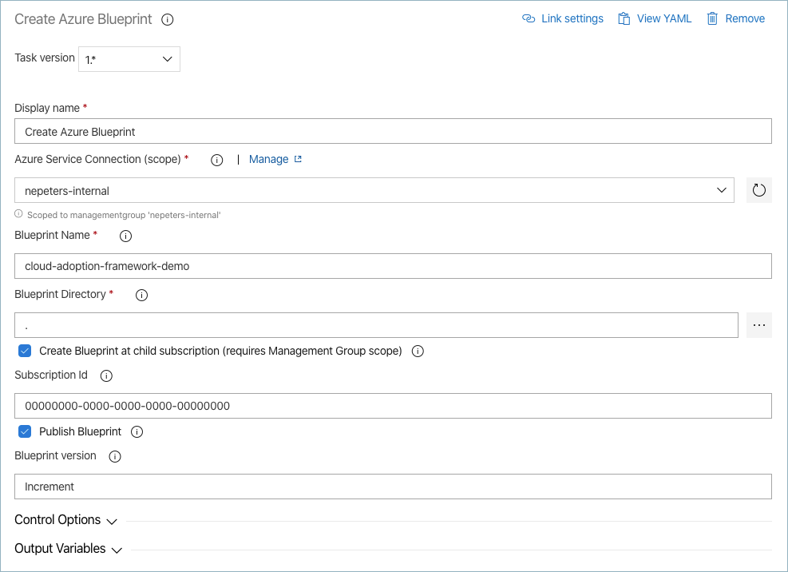
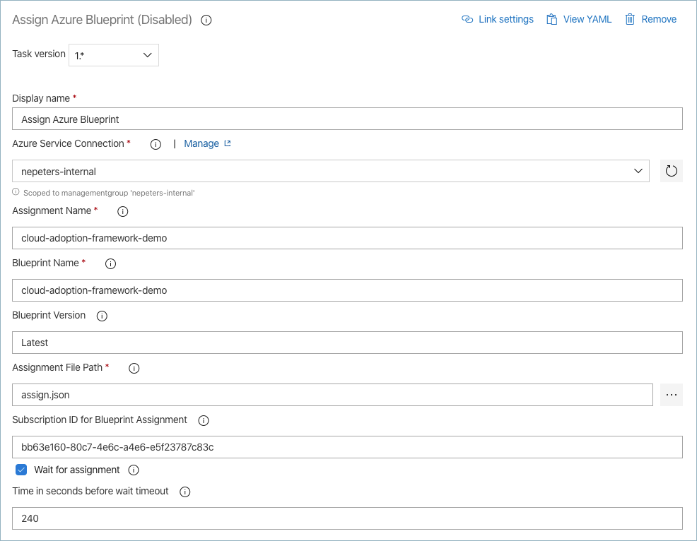

# Azure Pipeline extension for Azure Blueprints requirements

## Product overview and use case

The Azure Pipeline extension for Azure Blueprints will provide native pipeline tasks for creating and assigning Azure Blueprints. With these tasks, consumers can include Blueprint deployments and updates in continuous delivery solutions.

## Spec Metadata

### Stakeholders and teams

Rebecca Jones - tool side PM
Jeff Smith - service side PM
DevDiv Tools
Azure Pipelines SDK
Visual Studio Marketplace

### Link to Azure Boards work items

[Pipeline Extension for Blueprints Epix]()

[Pipeline Extension for Blueprints Activities]()

[Pipeline Extension for Blueprints docs]()

### Other related pages

[Public GitHub repository](https://github.com/neilpeterson/azure-blueprints-pipeline-tasks)

[Product Stategy Document](./blueprint-extension-strategy.md)

## Non-Functional Requirements

1. The extension must be built using PowerShell. This is due to the availability of an Azure Blueprints PowerShell module and the lack of a node SDK for Blueprints.

## Functional Requirememtns

### Authentication

| ID | Requirement | Complete |
|:---|---|---|
| 1 | I should be able to authenticate to an Azure Subscription using a Service Principal object. | Yes |
| [52](https://github.com/neilpeterson/azure-blueprints-pipeline-tasks/issues/52) | I should be able to authenticate to an Azure Subscription using a Managed Service Identity object. | No |

### Blueprint Creation Scope

| ID | Requirement | Complete |
|:---|---|---|
| 2 | I should be able to create a Blueprint at the Management Group scope. | Yes |
| 3 | I should be able to create a Blueprint at the Subscription scope. | Yes |
| 4 | I should be able to assign a Blueprint stored at an MG scope to a subscription. | Yes |
| 5 | I should be able to assign a Blueprint stored at a subscription scope to the same subscription. | Yes |

### Blueprint Creation

| ID | Requirement | Complete |
|:---|---|---|
| 6 | I should be able to give the blueprint a unique name | Yes |
| 7 | I should be able to provide a directory to the Blueprint definition file | Yes |
| 8 | When using the Azure Pipelines classic editor, I should be able to browse source control for the Blueprint definition. | Yes |
| 9 | When creating a Blueprint, I should be able to publish the Blueprint | Yes |
| 10 | When creating a Blueprint, I should be able to not publish the Blueprint. | Yes |
| 11 | When creating a BLueprint, I should be able to specify a version. | Yes |

### Updating a Blueprint

| ID | Requirement | Complete |
|:---|---|---|
| 12 | Blueprint updates should be idempotent | Yes |
| 13 | When updating a Blueprint, I should be able to automatically increment the version | Yes |

### Azure Pipeline Build Agents

| ID | Requirement | Complete |
|:---|---|---|
| 14 | I should be able to use Azure Pipeline hosted build agents. | Yes |
| [35]() | I should be able to use self-hosted build agents. | Yes |

### Blueprint Assignment

| ID | Requirement | Complete |
|:---|---|---|
| 15 | I should be able to give the blueprint assignment a unique name | Yes |
| 16 | I should be able to select the blueprint version for the assignment | Yes |
| 17 | I should be able to provide a directory to the Blueprint assignment file | Yes |
| 18 | When using the Azure Pipelines classic editor, I should be able to browse source control for the Blueprint assignment file. | Yes |
| 19 | I should be able to pause the task while the assignment operation is being performed. | Yes |
| 20 | During the assignment, I should be able to provide a timeout value after which the assignment fails. | Yes |

## Wireframe (Classic and YAML)

### Create Blueprint (classic)



### Create Blueprint (YAML)

```
steps:
- task: nepeters.azure-blueprints.CreateBlueprint.CreateBlueprint@1
  displayName: 'Create Azure Blueprint'
  inputs:
    azureSubscription: 'nepeters-internal'
    BlueprintName: 'cloud-adoption-framework-demo'
    BlueprintPath: .
    AlternateLocation: true
    AlternateSubscription: '00000000-0000-0000-0000-00000000'
    PublishBlueprint: true
```

### Assign Blueprint (classic)



### Assign Blueprint (YAML)

```
steps:
- task: nepeters.azure-blueprints.AssignBlueprint.AssignBlueprint@1
  displayName: 'Assign Azure Blueprint'
  inputs:
    azureSubscription: 'nepeters-internal'
    AssignmentName: 'cloud-adoption-framework-demo'
    BlueprintName: 'cloud-adoption-framework-demo'
    ParametersFile: assign.json
    SubscriptionID: 'bb63e160-80c7-4e6c-a4e6-e5f23787c83c'
    Wait: true
```


